# Neftecode 2026 — Предсказание характеристик моторного масла при окислительном тесте

Решение задачи хакатона __Neftecode 2026__. Задача — предсказать два физико-химических параметра моторного масла по результатам теста Daimler Oxidation Test (DOT): на основе состава смеси, свойств компонентов и условий испытания.

---

## Задача

**Вход:**
- Состав смеси: набор компонентов с массовыми долями (от 2 до ~10 компонентов на смесь)
- Свойства каждого компонента: числовые показатели (вязкость, содержание металлов, щелочное число и др.) и категориальные (класс субстрата, тип АО и др.)
- Условия испытания: температура, время, содержание биотоплива, дозировка катализатора

**Целевые переменные:**

| Таргет | Описание |
|--------|----------|
| `Delta Kin. Viscosity KV100` | Относительное изменение кинематической вязкости при 100°C после теста, % |
| `Oxidation EOT` | Показатель окисления в конце теста (End of Test), A/cm |

---

## Данные

Три CSV-файла в `data/`:

| Файл | Описание |
|------|----------|
| `daimler_mixtures_train.csv` | Обучающие смеси с таргетами |
| `daimler_mixtures_test.csv` | Тестовые смеси без таргетов |
| `daimler_component_properties.csv` | Свойства компонентов и партий (длинный формат) |

Главная единица данных — `scenario_id`: один идентификатор соответствует одной смеси и объединяет несколько строк-компонентов. В train/test каждая строка описывает один компонент внутри смеси с его массовой долей и условиями испытания.

Файл свойств хранится в длинном формате: `(Компонент, Партия, Показатель, Значение)`. При подготовке признаков он разворачивается в таблицу через pivot. Для партий, которых нет в справочнике, используются типовые значения компонента (`typical`).

---

## Подход: Deep Sets

Смесь — это **неупорядоченный набор компонентов**. Ни один ML-подход, ожидающий фиксированный вектор признаков, не подходит напрямую: количество компонентов в смесях разное, и порядок не имеет значения.

В основе решения — **Deep Sets** архитектура:

```
Смесь (набор компонентов)
    │
    ├─ ComponentEncoder (для каждого компонента отдельно)
    │   ├─ Числовые признаки × маски × попарные произведения
    │   ├─ Массовая доля компонента
    │   ├─ Условия испытания (через HyperNet → FilmLayer)
    │   └─ Categorical Embeddings
    │
    ├─ Агрегация (permutation-invariant)
    │   ├─ Mean Pooling
    │   ├─ Max Pooling
    │   └─ Attention Pooling
    │
    ├─ Condition Net (условия испытания отдельным путём)
    │
    └─ Regression Head → предсказание одного таргета
```

Обучаются **две отдельные модели** — по одной на каждый таргет.

**Ключевые особенности:**
- Маски признаков: ноль в матрице ≠ реальный ноль. Модель получает бинарную маску, чтобы отличать реальные значения от заполненных пропусков
- Условия испытания подаются и через `HyperNet` (модулируют компонентные эмбеддинги через FiLM-слой), и напрямую в голову регрессора
- Фильтрация признаков по покрытию: в train остаются только признаки, присутствующие хотя бы в 12% строк компонентов

---

## Результаты

Предсказания на тестовой выборке: [`predictions.csv`](predictions.csv)

Метрики отслеживались как MAE и RMSE на валидационной выборке (80/20 split по `scenario_id`).

---

## Важность признаков

После обучения строятся **SHAP-like gradient attribution** графики: для каждого признака каждого компонента вычисляется произведение градиента выхода модели на значение признака. Визуализация аналогична SHAP summary plot: ось X — вклад в предсказание, цвет — значение признака (от низкого к высокому).

Графики по группам компонентов лежат в [`feature_importance/`](feature_importance/).

### Target 1 — Delta Kin. Viscosity KV100

Наибольший суммарный вклад у **дисперсанта** и **противоизносной присадки**:

| Группа компонента | Признак | Средняя |attribution| |
|---|---|---|
| Дисперсант | Щелочное число, ASTM D2896 | 2.87 |
| Дисперсант | Кинематическая вязкость при 100°C | 2.40 |
| Противоизносная присадка | Щелочное число, ASTM D2896 | 1.36 |
| Антиоксидант | Кинематическая вязкость при 100°C | 1.19 |
| Противоизносная присадка | Массовая доля серы | 0.56 |
| Противоизносная присадка | Кинематическая вязкость при 100°C | 0.54 |
| Противоизносная присадка | Массовая доля цинка | 0.47 |
| Детергент | Щелочное число, ASTM D2896 | 0.42 |

**Дисперсант — вклад в Target 1:**

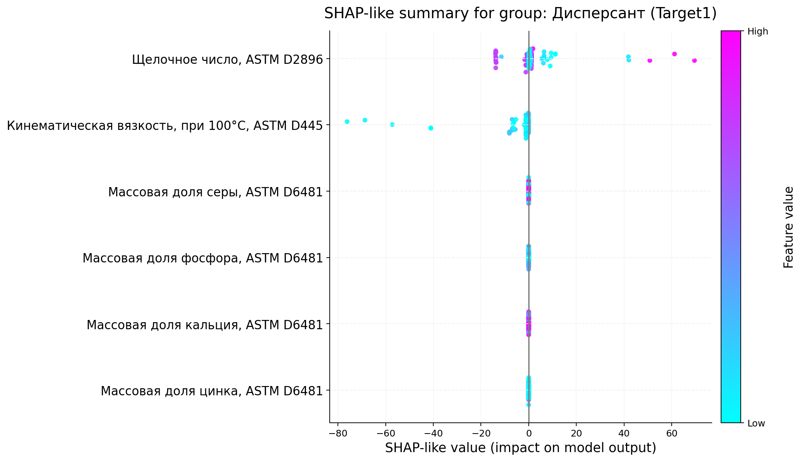

---

### Target 2 — Oxidation EOT

Для окисления ключевую роль играет **противоизносная присадка** — с большим отрывом:

| Группа компонента | Признак | Средняя |attribution| |
|---|---|---|
| Противоизносная присадка | Кинематическая вязкость при 100°C | **26.1** |
| Противоизносная присадка | Массовая доля серы | **17.4** |
| Противоизносная присадка | Щелочное число, ASTM D2896 | 7.90 |
| Противоизносная присадка | Массовая доля цинка | 6.10 |
| Противоизносная присадка | Массовая доля фосфора | 5.51 |
| Антиоксидант | Кинематическая вязкость при 100°C | 1.44 |
| Дисперсант | Кинематическая вязкость при 100°C | 0.14 |
| Детергент | Щелочное число, ASTM D2896 | 0.11 |

Высокая вязкость противоизносной присадки смещает предсказание в сторону более высокого окисления (цвет High — вправо). Высокое содержание серы — наоборот, снижает (цвет High — влево):

**Противоизносная присадка — вклад в Target 2:**

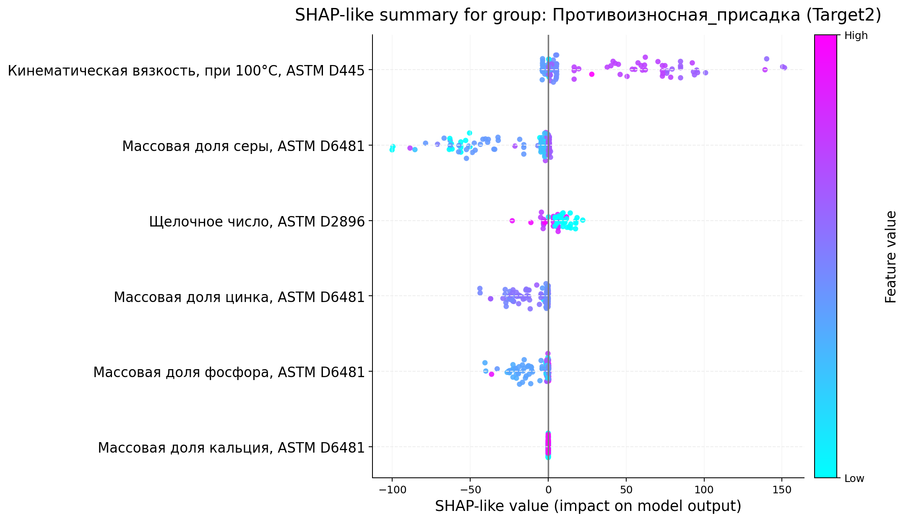

<details>
<summary>Остальные группы компонентов (Target 1)</summary>

**Антиоксидант:**
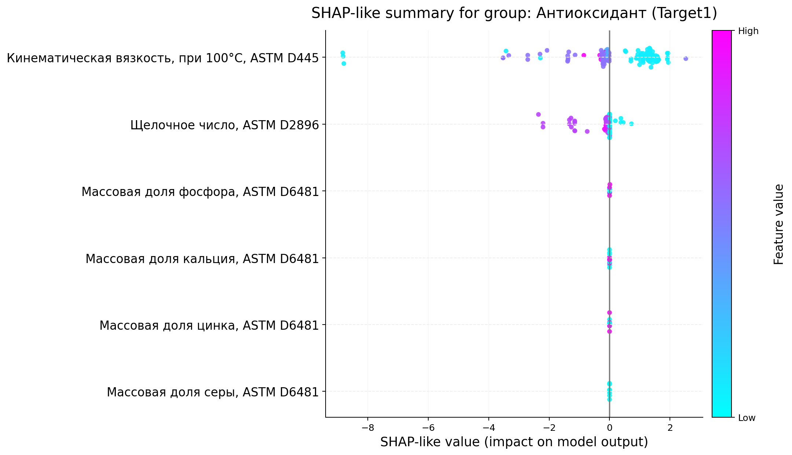

**Базовое масло:**
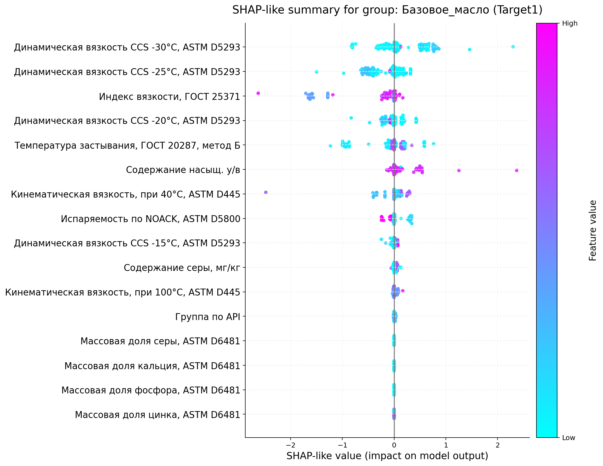

**Детергент:**
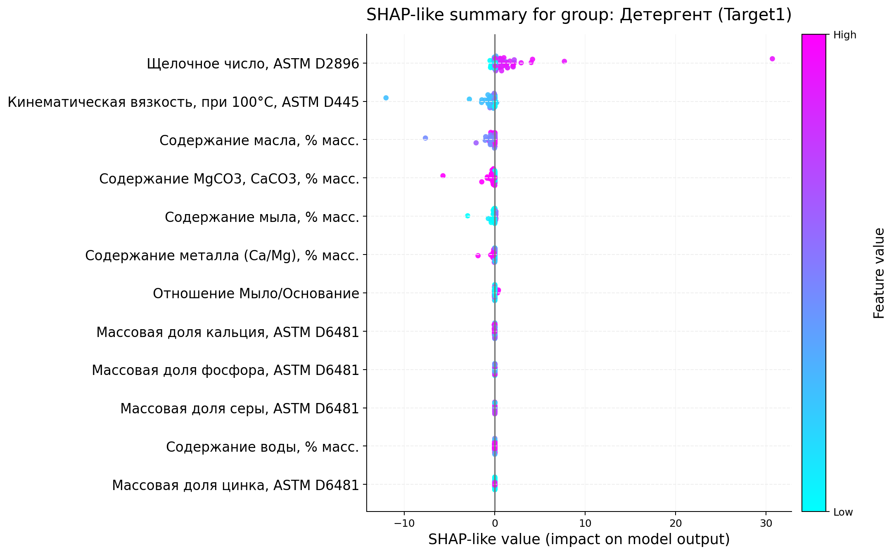

**Депрессорная присадка:**
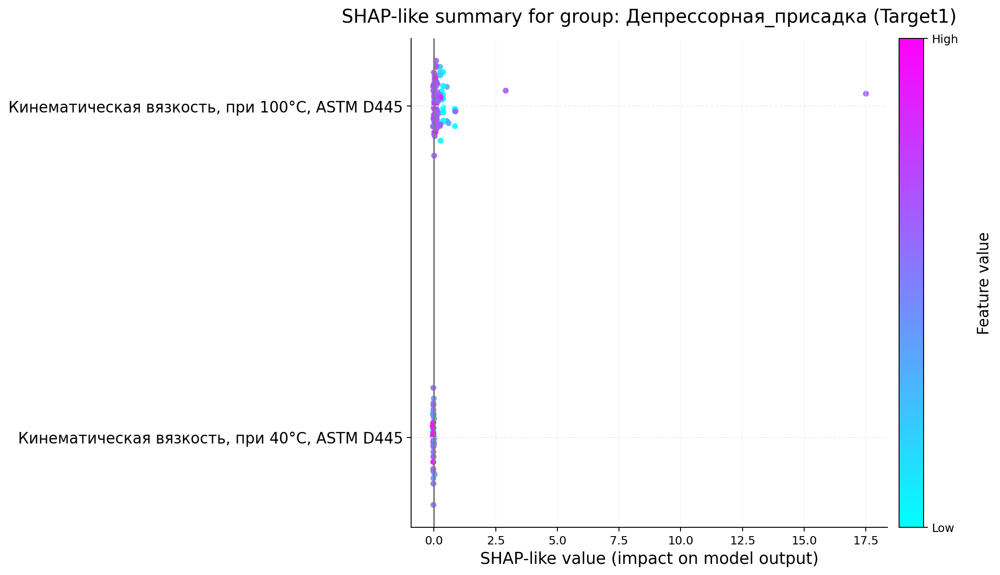

**Загуститель:**
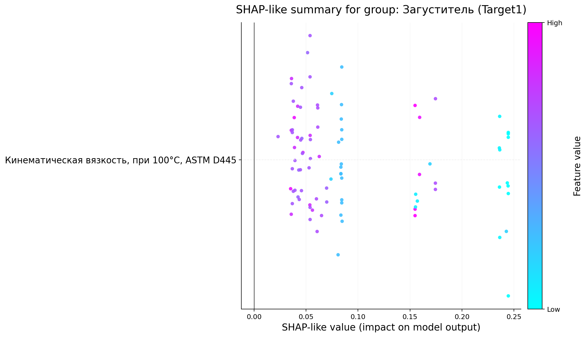

**Противоизносная присадка:**
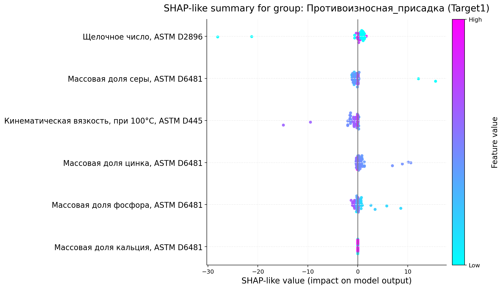

**Соединение молибдена:**


</details>

<details>
<summary>Остальные группы компонентов (Target 2)</summary>

**Антиоксидант:**
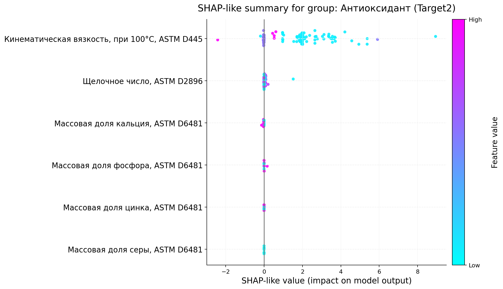

**Базовое масло:**
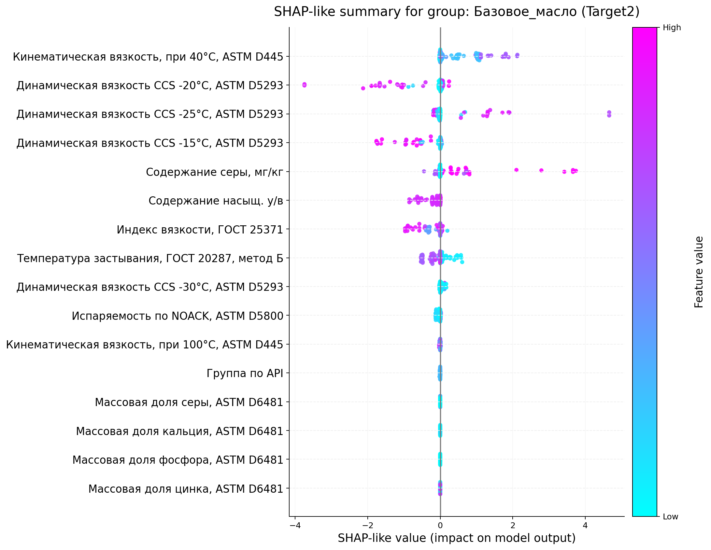

**Детергент:**
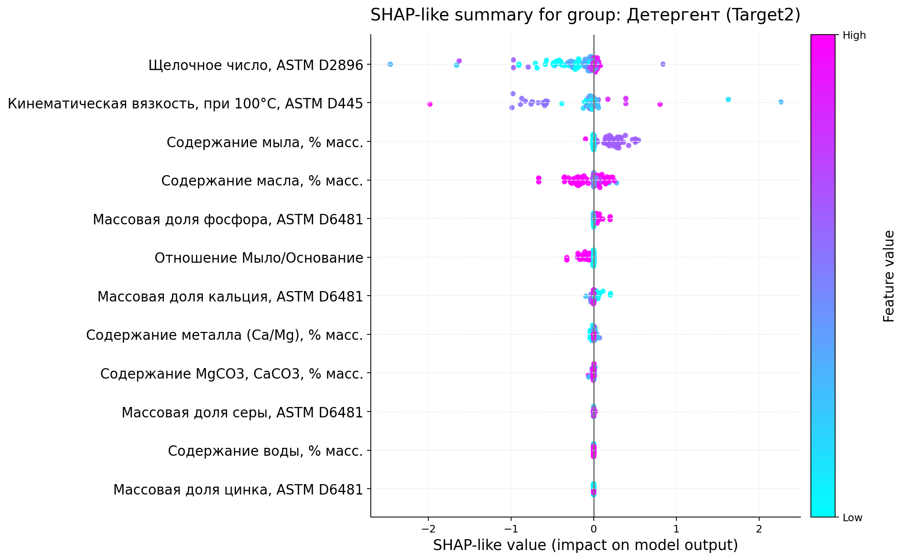

**Депрессорная присадка:**
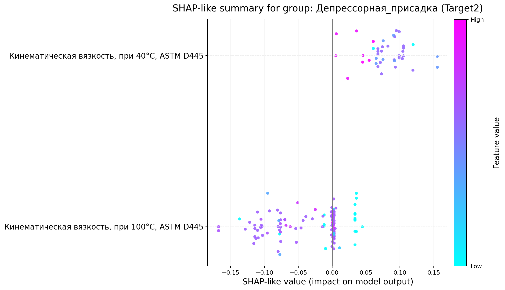

**Дисперсант:**
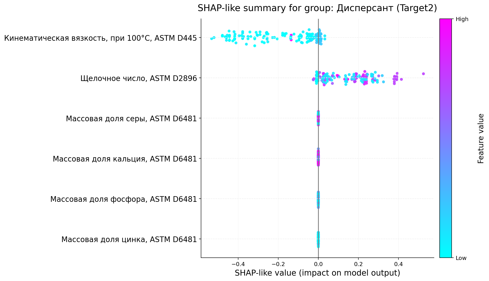

**Загуститель:**
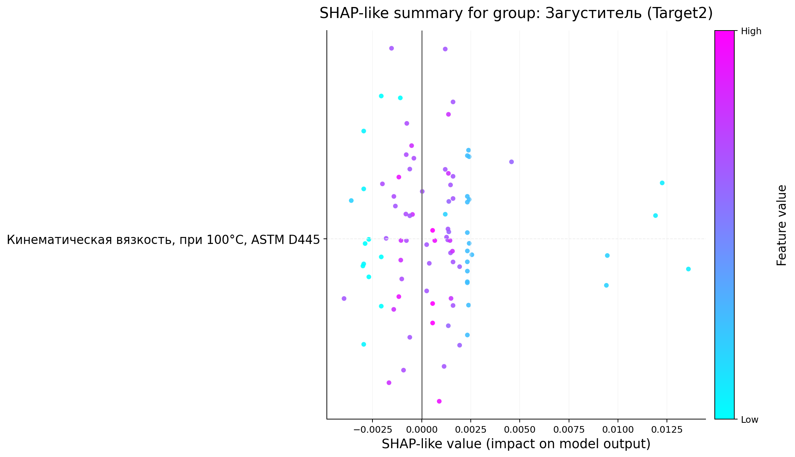

**Соединение молибдена:**
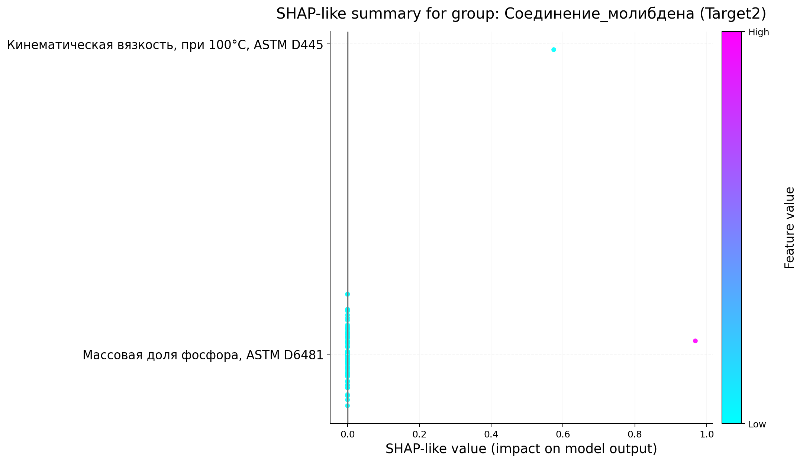

</details>

---

## Структура проекта

```
neftecode-2026/
├── data/                          # Исходные CSV-файлы
│   ├── daimler_mixtures_train.csv
│   ├── daimler_mixtures_test.csv
│   └── daimler_component_properties.csv
├── data-preprocessing/
│   └── data_preprocessing.ipynb  # Разведочный анализ и препроцессинг
├── src/
│   ├── training_pipeline.py       # Обучение модели
│   ├── inference_from_artifacts.py# Инференс из чекпойнтов
│   ├── generate_feature_importance.py # Построение SHAP-like графиков
│   ├── docker_entrypoint.py       # Точка входа Docker
│   ├── inference.ipynb            # Notebook для инференса
│   ├── Dockerfile
│   └── requirements.txt
├── artifacts/                     # Обученные чекпойнты (.pt)
├── feature_importance/            # SHAP-like графики по группам компонентов
└── predictions.csv                # Предсказания на тестовой выборке
```

---

## Запуск

### Установка зависимостей

```bash
python -m venv .venv
source .venv/bin/activate
pip install torch==2.5.1 --index-url https://download.pytorch.org/whl/cpu
pip install -r src/requirements.txt
```

### Инференс из готовых чекпойнтов

Чекпойнты уже лежат в `artifacts/`. Чтобы получить предсказания:

```bash
python src/inference_from_artifacts.py --output predictions.csv
```

### Обучение с нуля

```bash
python src/training_pipeline.py
```

Скрипт обучит две модели (по одной на таргет) и сохранит чекпойнты в `artifacts/`.

### Генерация графиков важности признаков

```bash
python src/generate_feature_importance.py --output-dir feature_importance
```

### Запуск через Docker

**Сборка образа:**
```bash
docker build -f src/Dockerfile -t neftecode-solution .
```

**Инференс + генерация feature importance:**
```bash
mkdir -p output
docker run --rm -v "$(pwd)/output:/output" neftecode-solution
```

После запуска в `output/` появятся:
- `output/predictions.csv` — предсказания
- `output/feature_importance/` — SHAP-like графики
- `output/artifacts/` — чекпойнты (если обучение запускалось внутри контейнера)

Если чекпойнты уже есть в `artifacts/` (как в этом репозитории), обучение пропускается — запускается только инференс.

## Команда

|     | Имя | GitHub | Позиция |
|-----|-----|--------|---------|
| 1. | Баталев Вадим | [**d0zya**](https://github.com/d0zya) | ML |
| 2. | Лунегова Дарья | [**long_on_fire**](https://github.com/lung-on-fire) | ML |
| 3. | Леонович Илья | [**Rectorator**](https://github.com/Rectorator) | ML |
